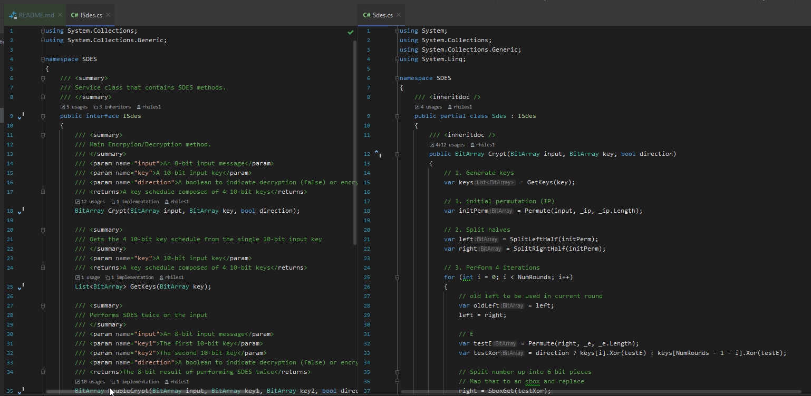
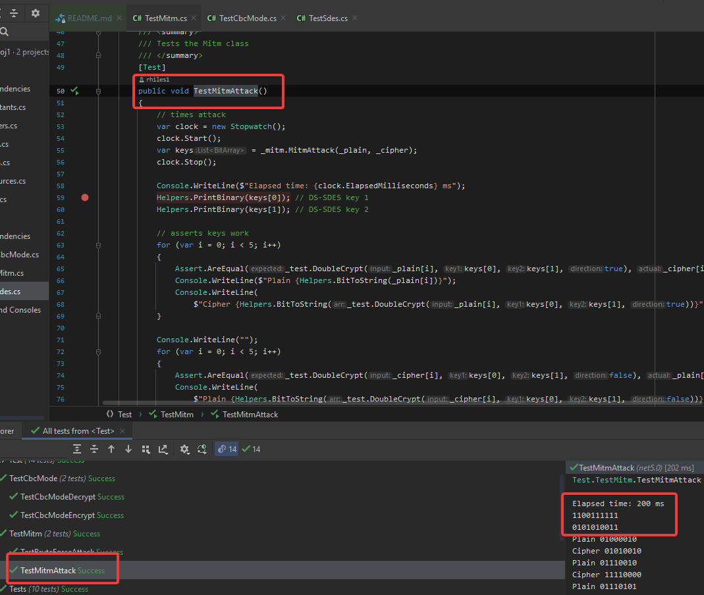
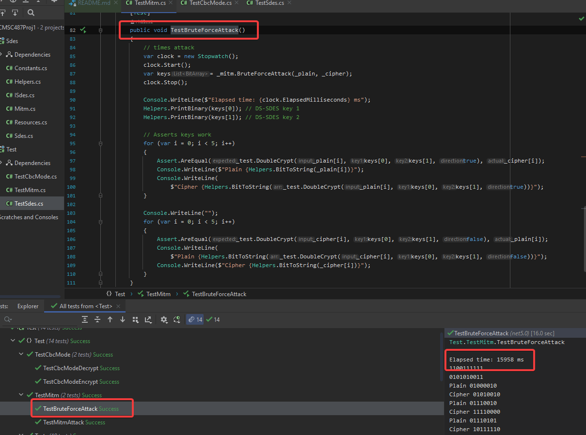
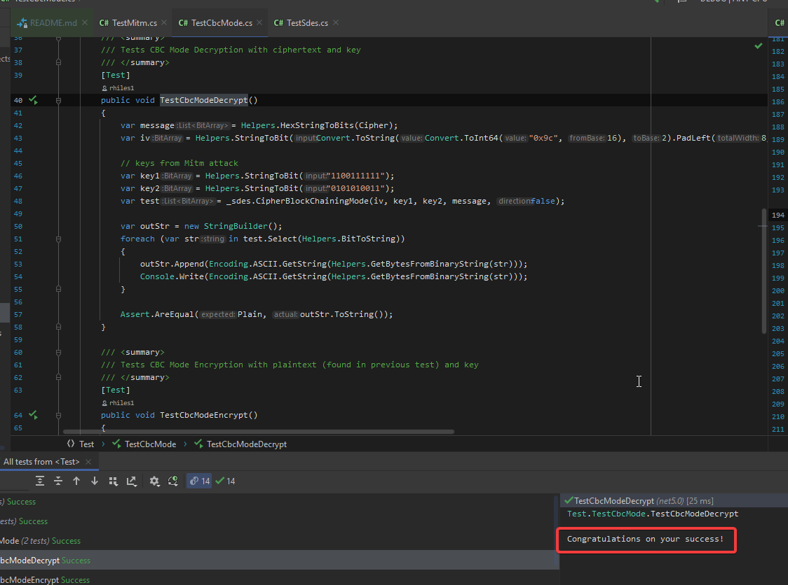
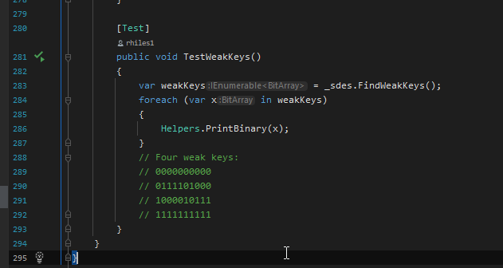

# CMSC487Proj1
## Robert Hiles
# Implementation Notes
This project was implemented using C# with the .NET 5.0 framework.  There is a Solution containing two Projects: one class library containing the SDES, DS-SDES, Mitm attack, brute force attack, constants, and other helper methods and a unit test library to "drive" the class library.

# 1. The commented code for your implementation of S-DES.
S-DES (and DS-DES) were implemented in the Sdes class (a public partial class spread across Sdes.cs, Resources.cs, and Constants.cs).  The Sdes class is behind the ISdes interface which exposes the "core" methods of the class to the Tests.  Below is a breakdown of each file:
### Code: 
- `ISdes.cs`: Interface that exposes public Sdes methods
- `Sdes.cs`: the "main" public methods of Sdes (Crypt, DoubleCrypt, GetKeys)
- `Resources.cs`: Provides resource methods to do operations C# is limited in (such as bit manipulation)
- `Constants.cs`: Contains constants, SBoxs, Initial Permutations, Inverse Initial Permutations, bit shifts, etc.
- `Helpers.cs`: Contains helper functions for unit tests (such as print and Bit/Hex/string conversions)

# 2. The key used to produce the ciphertext in the known plaintext/ciphertext pairs.
- 20-bit key bundle (k1, k2) = (1100111111, 0101010011)

# 3. The code you used to implement your Meet in the Middle attack, along with the time your attack took to determine the key.
### Code:
- `Mitm.cs`: Contains code for Mitm attack
- `TestMitm.cs`: Code that tests or "drives" the Mitm Class
### Sample time:
- Mitm attack: `elapsed time: 200 ms`

# 4. The code for your brute force key search, along with the time it takes to uncover the key.
### Code:
- `Mitm.cs`: Contains code for brute force attack
- `TestMitm.cs`: Code that tests or "drives" the Mitm Class
### Sample time:
- Brute force attack: `elapsed time: 15958 ms`

# 5. The decryption of the text encrypted using CBC mode with the key you discovered and the code you used to decrypt it.
### Code:
- `Sdes.cs` CipherBlockChainingMode() method
- `TestCbcMode.cs`: Code that tests or "drives" the CipherBlockChainingMode method
### Plain text:
- "Congratulations on your success!"

# 6. A list of the S-DES weak keys.
### Weak keys
- 0000000000
- 0111101000
- 1000010111
- 1111111111
### Code:
- `Sdes.cs` FindWeakKeys() method
- `TestCbcMode.cs: TestWeakKeys()`: Code that tests or "drives" the FindWeakKeys method
